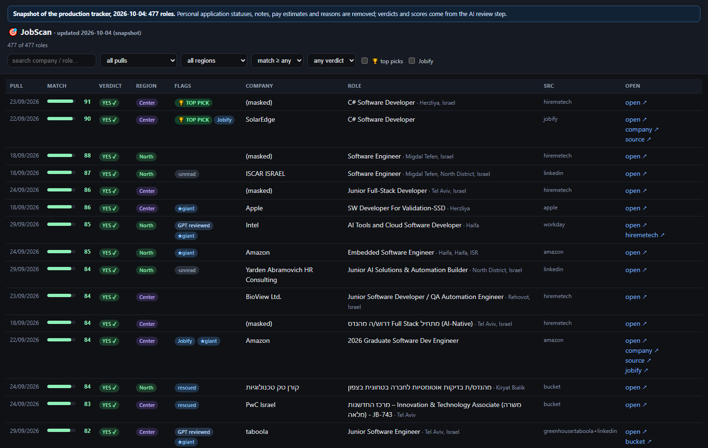
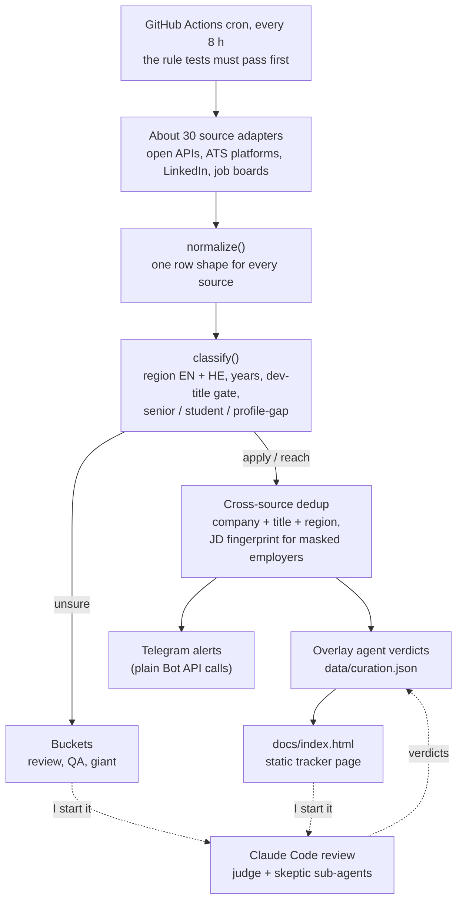

# JobScan

A job scanner I built for my own job search. It reads about 30 Israeli job sources, filters them
with tested rules in English and Hebrew, merges duplicates across sources, and publishes one
tracker page. Claude Code agents wrote most of the code. I set the requirements and acceptance
criteria, made the rule decisions, and checked the agents' work against reality.

[](https://github.com/Ron-Salama/jobscan/actions/workflows/tests.yml)

**Stack:** Python · data pipeline over REST/JSON APIs, ATS platforms and HTML scrapers · bilingual
(English + Hebrew) rule engine · GitHub Actions CI/CD with regression tests gating every run ·
monitoring and alerting (source-health alarm, Telegram) · Claude Code multi-agent review (judge +
skeptic sub-agents) · CLAUDE.md agent context

**Live tracker snapshot:** [ron-salama.github.io/jobscan](https://ron-salama.github.io/jobscan/)



<sub>A sanitized snapshot of the production tracker (`docs/index.html`, 477 roles on 2026-10-04): the
real listings with the verdicts and scores from the AI review step. My application statuses, notes,
pay estimates, CV labels and verdict reasons are removed. Built by `tools/build_snapshot.py`.</sub>

## What it does

One production run (2026-10-04, 17 minutes on GitHub Actions):

| Step | Roles |
|---|---|
| Raw postings from 30 sources | 7,256 |
| Pass the rules (region, title gate, seniority, years) | 483 |
| After cross-source dedup | 478 |
| New since the last run | 10 |
| On the tracker page (it also carries roles from earlier runs) | 500 |

Roles the rules are unsure about go to three buckets instead of being dropped. In that run the
giant bucket kept 1,587 of 1,588 (one duplicate URL) and the QA bucket kept 170 of 186 (16 were
already on the page). The review bucket flagged 2,941 and kept 500: 114 were already on the page,
1,433 were already in the giant bucket, 3 were duplicate URLs, and a 500-row cap cut the 891
lowest-priority rows.

- **Sources:** open JSON APIs (hiremetech, Drushim, Experis GraphQL, amazon.jobs); ATS platforms
  (Workday for 12 companies through each one's Israel location facet, 27 Greenhouse boards,
  24 Comeet boards, Lever, Ashby, SmartRecruiters, Eightfold, Oracle HCM); LinkedIn's guest jobs
  API; Israeli job boards and company career sites.
- **Rules:** region from English and Hebrew city names (Hebrew prefix letters included), required
  years parsed from the JD ("0-3 years" counts as 0, "advantage" years are ignored), a developer
  title gate, senior / student / DevOps-ML detection.
- **Output:** one static, filterable HTML tracker page; Telegram alerts for new roles at large
  employers and referral companies; a source-health alarm when a source goes dark. The page in
  `docs/` is a sanitized snapshot of the production page: 477 of its 500 rows (rows that only my
  own status marks or pins kept on the page, and roles at employers on a local blocklist, are left
  out), with the listings, verdicts, scores and verdict basis, and none of the personal fields.
- **AI review step, outside the pipeline:** 4,059 verdicts so far (2,784 made from the full JD),
  from several passes: Claude Code agent passes, and one GPT-run review of about 1,280 bucket
  roles, mostly from titles, which Claude agents partly re-checked. Since 2026-10-01, Claude Code
  judge sub-agents score new roles and skeptic sub-agents attack each verdict (193 roles so far).
  See [docs/agents](docs/agents/).
- Running unattended in the cloud since 2026-09-17: every 2 hours at first, every 8 hours since the
  repo went private on 2026-10-04 (GitHub Actions free minutes). About 10,000 lines of Python, plus
  850 lines of tests.

## Architecture



Each run commits the updated data and page back to the private repo. Every adapter runs in its
own try/except, so one broken site can't stop a scan, and the source-health check flags a source
whose yield drops to zero or below 30% of its best run.

## Four times the agents were wrong

From the private development history.

- **A revert reported as verified while the site still served the rewrite.** A GPT session
  replaced the working scanner with a full rewrite (a new package, rewritten core modules and a
  generated 29,700-line data file). The rewrite was reverted and kept on a branch, and Claude
  reported the revert as "verified working in the cloud". I opened the live URL: it still served
  the rewrite, because the rewrite had switched GitHub Pages to deploy from an Actions artifact.
  After the Pages setting was fixed, the rewrite's three valid bug findings were kept as one
  22-line commit, and its three rule changes came to me as decisions. Lesson: "verified" means
  checking the deployed page, not the commit.
- **A fix that counted the wrong rows.** I noticed NVIDIA roles I knew were open never reached the
  tracker. The Workday adapter searched only "software" with a page cap. The agent's first fix
  reported a jump from 21 to 293 roles, but that count included postings outside Israel. An
  independent multi-agent audit I asked for caught the overcount. The real fix reads each
  company's Israel location facet and pages to the end (NVIDIA: 425 of 425 Israel postings at
  the time). Evidence: [`sources/workday.py`](sources/workday.py) now logs "facet total vs fetched"
  for every company on every run.
- **Verdicts that looked JD-based but came from titles.** I asked for a judgment pass over 208
  roles, and the verdicts read as if they came from the job descriptions. I asked: "did you really
  read the whole JD?" The agent admitted it had judged from titles only. The pass was redone from
  fetched JDs where the site allowed it (134 of the 208); 19 verdicts changed, and the other 74
  stayed marked as title-only. Evidence: every verdict now carries a `basis` field
  ([docs/agents](docs/agents/README.md#1-packs)), and the page marks JD-read verdicts with ✓.
- **A contradiction dismissed as cosmetic.** I spotted roles marked REACH with the top fit score
  (5 of 5). The agent had earlier called it cosmetic. The fix replaced the 1-5 fit on judged rows
  with a 0-100 score locked to the verdict's band (YES 70-97, REACH 45-69, NO 15-44), so a verdict
  and its score can't disagree. Evidence: the band table in [judge.md](docs/agents/judge.md).

## How I build it

1. **Acceptance test before code.** My condition before building anything: the scanner had to
   find, on its own, every job posted that day in a WhatsApp job group I follow (checked by hand
   against one day of the group). The first design found 47%. The redesign found 34 of 36 (94%),
   and both misses had known causes. Only then did the build start.
2. **Agents write, I check against reality.** I give the agents the requirement and the
   acceptance criteria; Claude Code writes the code and the spec files. I check the result: run
   it, open the live page, compare it with an independent job feed, and challenge the agent's
   claims. For a full rules audit, three implementer agents worked in parallel in separate git
   worktrees (rules, adapters, pipeline), independent reviewer agents checked their work, and the
   21 fixes from that review merged as a fourth branch.
3. **Tests gate the scan.** The cases in `tests/test_rules.py` come from real roles, locations and
   JD snippets that a rule once got wrong. A rule bug gets a regression test that fails on the old
   code. The production workflow runs the suite before every scan, and a failure stops the scan.
4. **Rule changes are my decisions.** The agents propose rule changes with example roles; I decide.
   The decisions are numbered in the code (`owner's call #7`: DevOps and ML-engineering titles cap
   at REACH unless the opening is purely junior). In code comments, "owner" means me.
5. **Judgment goes to agents whose output I can check.** Judge sub-agents score roles with a
   band-locked score, then skeptic sub-agents try to refute each verdict from the full JD. Over
   2026-10-01 to 10-03, skeptics changed 13 of 193 outputs (6 verdict flips). Specs:
   [judge](docs/agents/judge.md), [skeptic](docs/agents/skeptic.md).
6. **CLAUDE.md.** During development the agents' context lived in Claude Code memory notes and the
   written judge and skeptic specs. For this public snapshot it was consolidated into
   [CLAUDE.md](CLAUDE.md): architecture, commands, and the rules of the road (no LLM in the
   pipeline, bucket instead of drop, adapters never raise, atomic writes).
7. **Cross-checks against reality.** Comparing the tracker with that WhatsApp group exposed misses.
   Claude traced them to two root causes: LinkedIn's QA/automation search was starved by a result
   cap it shared with the developer search, and hiremetech's search feed placed some Israeli jobs
   in India. Both fixes came with regression tests that fail on the old code
   (`test_linkedin_qa_lane_not_starved`, `test_hiremetech_abroad_feed_rows_rechecked`).

## Design decisions

- **No LLM inside the pipeline.** Scanning, filtering, dedup and the page are deterministic Python:
  the same input gives the same output, the tests run in under a second with no network, there
  are no API keys or per-call costs, and the pipeline can't invent a job. Model judgment lives in
  the review step, where its output is data I can inspect and overrule.
- **Unsure means bucket, not drop.** A keyword rule will misread some roles, so set-aside roles go
  to a bucket with a reason tag and a JD snippet. The giant bucket keeps every role at a large
  employer, at any level, uncapped. The review bucket is ordered by how likely a real miss hides
  in each row and capped at 500, so on a busy day its lowest-priority rows are cut (891 on
  2026-10-04); that cap is the first thing on the list below.
- **Band-locked scores.** A judged row's score must sit in its verdict's band. The score orders
  the page; the band makes contradictions impossible.
- **Whole words, two languages.** Short tokens match as whole words: `sap` must not match
  Sapiens, `intern` must not match internal, and a Hebrew city name may carry one or two prefix
  letters (ב, ה, ו...) without matching inside another word.
- **State that fails loudly.** Writes are atomic (temp file + rename). A corrupt state file stops
  the run instead of being overwritten with an empty default. Undelivered alerts are queued and
  retried, and three runs in a row with undelivered alerts fail the workflow.
- **A static page.** One self-contained HTML file. Statuses and notes live in the browser, with
  export / import between devices. No server to run.

## Repo layout

```
jobscan.py            core pipeline: 5 open-API sources, rules, dedup, alert queue
cloud_run.py          production entry: state files, curation overlay, page builder, buckets
config.py             rule data: regions (EN + HE), title gates, seniority markers, company lists
notify.py             Telegram / CallMeBot delivery
sources/              29 adapters in 28 modules, one per source (25 run in production)
sources_ext.py        compatibility shim (re-exports sources/)
tests/test_rules.py   64 network-free regression tests
docs/agents/          judge and skeptic specs, example profile, how the review step works
docs/index.html       tracker snapshot: the production page minus personal fields (tools/build_snapshot.py)
docs/snapshot/        the snapshot's rows as JSON
tools/                Telegram setup, local runner, snapshot builder
.github/workflows/    tests.yml (CI); scan.yml (production scan, runs only in a private repo)
CLAUDE.md             context file for AI coding agents
```

## Run it locally

```bash
pip install -r requirements.txt
python tests/test_rules.py                       # the 64 tests, no network (or: python -m pytest -q tests)
JOBSCAN_NO_ALERT=1 python cloud_run.py           # full scan, about 20 min; writes data/ and docs/index.html
python cloud_run.py --rebuild-only               # no network: re-apply data/curation.json, rebuild the page
python tools/build_snapshot.py                   # sanitized snapshot of data/ -> docs/index.html + docs/snapshot/
```

A scan or rebuild overwrites the snapshot in `docs/index.html` with the full page
(`git checkout docs/index.html` restores it). `build_snapshot.py` reads an optional local list of
employers to leave out (`snapshot_blocklist.txt`, gitignored); without one, pass `--no-blocklist`.
On PowerShell, set the variable first: `$env:JOBSCAN_NO_ALERT=1`. For alerts, copy
`notify_config.example.py` to `notify_config.py` (gitignored) or set `TELEGRAM_TOKEN` and
`TELEGRAM_CHAT_ID`. To deploy it yourself, use a **private** repo (`scan.yml` skips public ones,
since a scan commits job data) and add those two secrets. GitHub Pages on a private repo needs a
paid plan, and the published site is public even then, so if the data is personal, skip Pages and
open `docs/index.html` locally.

CI ([tests.yml](.github/workflows/tests.yml)) runs the tests on every push. In this public repo
the scheduled `JobScan` workflow shows up as a skipped run every 8 hours: that is the
private-repo guard working.

## About this repo

This is a public snapshot of a private production deployment: the code, plus one sanitized
snapshot of the tracker page. The private repo has
about 290 commits, roughly half of them automated scan commits, and it holds my personal
job-search data (application statuses, notes, verdict reasons), which is why it is private.

In this snapshot, the referral-company list, the pay-estimate table and the CV labels in
`config.py` are placeholders, test fixtures that came from my own tracker use made-up companies,
and comments that described my private search were neutralized. The page in `docs/` is a sanitized
snapshot of the production tracker: `tools/build_snapshot.py` keeps the listings, verdicts, scores
and verdict basis, and removes statuses, notes, pay estimates, CV labels, pins, referral and
outsourcing tags and the written verdict reasons. Otherwise this is the production code as of
2026-10-04, including the split of the adapters (until then one 7,180-line `sources_ext.py`) into
the `sources/` package with their function bodies unchanged; a shim keeps the old imports working.

Most of the code was written by Claude Code agents. I owned the requirements and acceptance
checks, the rule decisions, the reviews, and noticing the errors above, or ordering the audit
that caught them.

## What I'd do next

- Remove or rethink the review-bucket cap (it cut 891 rows on 2026-10-04), so "bucket, not drop"
  holds on busy days too.
- Measure the review step: hand-label a blind random sample and report judge-vs-label and
  skeptic-vs-label agreement. Then use the verdicts as an eval set for the deterministic title
  gate, split by provenance first, since the title-only and GPT verdicts are noisier labels.
- Move the pack, JD-fetch and merge scripts of the review step into this repo, with tests, so the
  step is reproducible end to end.
- Record a small fixture per source and add adapter smoke tests to CI, so a site change shows up
  as a failing test instead of a source-health alarm. With those in place, move the HTTP setup
  every adapter repeats into one shared helper.
- Split `classify()` into small named rules and store a rule trace on each row ("why is this here?").
- Retire the legacy local mode (`jobscan.main`, which appends to an existing HTML file).

## License

[MIT](LICENSE)
