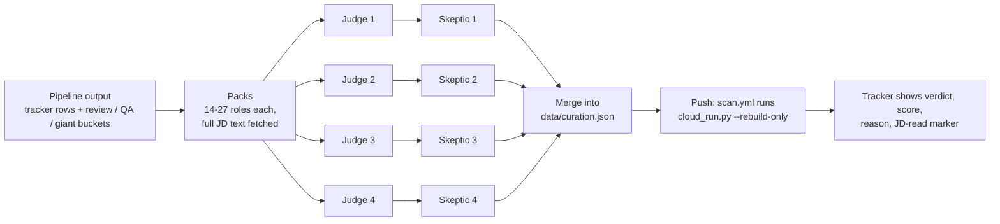

# The AI review step: judge, skeptic, merge

The scan pipeline calls **no** language model. It filters with deterministic rules, and every
role a rule is unsure about goes to a bucket instead of being dropped. The judgment calls
happen here, in a separate step that I start by hand in a Claude Code session. The agents'
output is plain data (`data/curation.json`) that the pipeline overlays on the tracker.



## 1. Packs

A pack is a JSON list of roles. Each role carries its id, company, title, location, source,
the scanner's region, giant/referral flags, the URL and the **full JD text**, fetched before
judging. A verdict made from a title alone is marked `basis: "title"`, and the tracker shows the
difference. That rule exists because one early pass delivered title-only verdicts that looked
JD-based (see the main README).

## 2. Judges (up to four Claude Code sub-agents in parallel)

Each judge gets one pack, [`judge.md`](judge.md) and the candidate profile
([`profile.example.md`](profile.example.md) shows the structure). It returns one object per role:
verdict, band-locked score, a 2-4 sentence reason, years, region, CV variant and pay track.
`judge.md` and `skeptic.md` are the production specs with the candidate's personal details
replaced by references to `profile.md`.

The score bands are part of the verdict: YES 70-97, REACH 45-69, NO 15-44. A "REACH with a
top score" contradiction can't be written down.

## 3. Skeptics (one per judge pack)

Each skeptic re-reads the full JDs and tries to break every verdict in both directions, using
[`skeptic.md`](skeptic.md): years misread (Hebrew included), wrong region, a skill credited that
the profile doesn't list, a must-have the judge skipped, or a fitting junior role killed with a
NO. It outputs the final verdicts with `first`, `changed` and a one-line `note`.

**Measured, 2026-10-01 to 2026-10-03:** 193 roles in 10 packs. The skeptics changed 13 outputs.
6 were verdict flips (3 YES to REACH, 3 REACH to NO, for example a required 85+ grade average the
judge missed, and a "4+ years, mandatory" requirement in a Drushim JD). The other 7 corrected the region,
years, score or reason. All 6 flips were downgrades. Whether the skeptics were right has not been
measured yet: that needs a blind, hand-labeled sample (see "What I'd do next" in the main README).

## 4. Merge and publish

Final verdicts merge into `data/curation.json` under `verdicts`, keyed by posting URL:

```json
{"verdicts": {"https://...": {"v": "REACH", "score": 55, "why": "...", "basis": "jd",
                              "cv": "...", "region": "North", "track": "test-eng"}}}
```

- A **NO** is a tombstone: the row leaves the tracker and is never re-injected, even if another
  map still lists it as YES/REACH (`cloud_run.apply_curation`). A NO also wins a trailing-slash
  URL collision (`test_review_cloud_run_helpers`).
- A **YES/REACH rescued from a bucket** goes into the `rescued` map and is injected onto the tracker.
- Pushing `data/curation.json` triggers `scan.yml`, which runs `cloud_run.py --rebuild-only`
  (no scan, no alerts) and republishes the page within minutes.

As of 2026-10-03 the production curation file holds 4,059 verdicts from several review passes,
and most of them predate this judge -> skeptic flow:

| Pass | Verdicts |
|---|---|
| Earlier Claude Code review passes (single agents, before 2026-10-01), rechecks and a few manual entries | about 2,590 |
| Judge -> skeptic, as described here (2026-10-01 to 10-03) | 193 |
| One GPT-run review of bucket roles (2026-09-29), mostly from titles; Claude agents re-checked part of it | 1,280 |

2,784 verdicts were made from the full JD and 1,275 from the title only (1,147 of those are in
the GPT batch). The page marks which basis each verdict had.

The tracker snapshot in `docs/` shows the production verdicts (YES / REACH), their scores and
basis, without the written reasons; NO verdicts are not on the page. `profile.example.md` is a
fictional example of the profile format, not the profile those verdicts were made for.

## What is not in this repo

- The real profile and `data/curation.json` (personal data).
- The one-off helper scripts that built packs, fetched JDs and merged results. They lived in a
  local work folder next to personal data and were never part of the pipeline.
